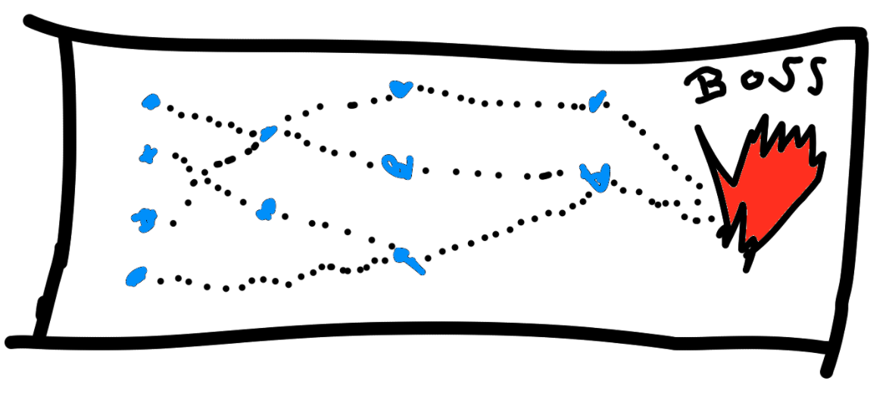
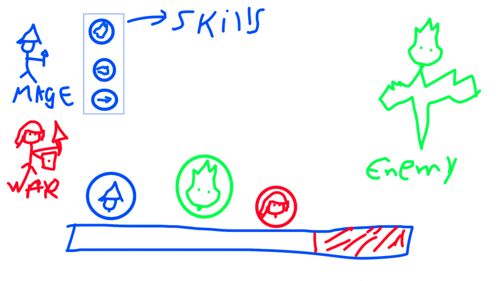

# Mythical Dungeonm

Mythic Dungeon is a turn-based rpg where the player has to go through a map to get resources and invites party members to defeat a boss.

## Map

The map has some paths with challenges and perks to evolve your party.

## Battle System

The battle system consists of the speed of party members and enemies, which rush into the battle action at the bottom of the screen. The Battle Action has an action time, for the player or the enemy to fire a skill the group member icon has to be inside the action bar (represented by red lines), so the player can choose which skill he will use and then the party member's icon (turn) will go to the init of the action bar.